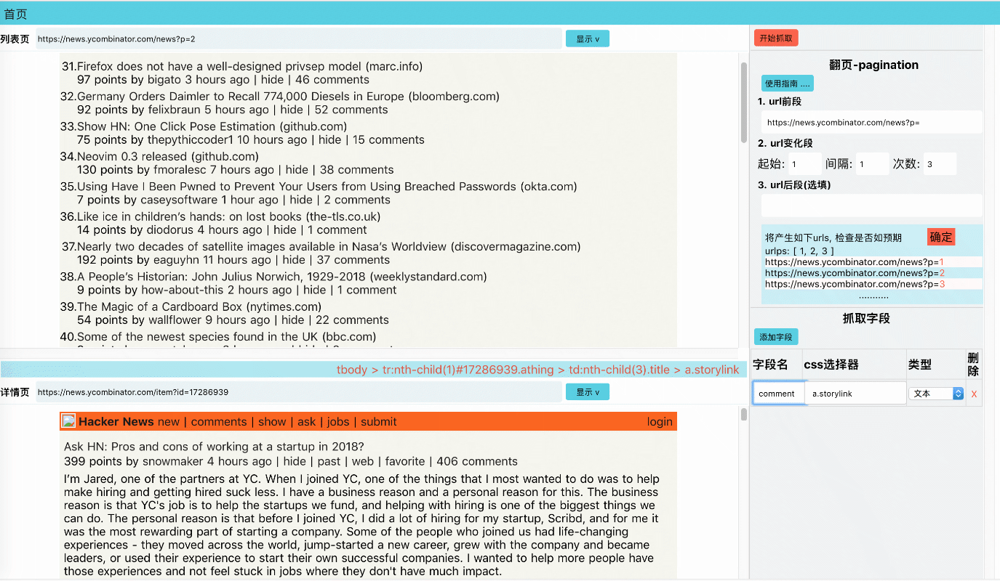

### [可视化爬虫小工具](http://gongsongping.com/nuxta/nospider)

页面仅供展示,要使用请 clone 到本地安装



---

- ### 技术参考
  > 前端 Vue.js, 后端 Express.js.
- ### 如何使用
  ```bash
  npm install
  npm run dev
  ```
- ### 功能说明
  1.  本工具只能小规模抓取页面, 要大规模抓取请使用专业抓取工具,如 Python scrapy.
  2.  左上列表页和左下详情页可以显示具体页面, 在页面上点一点就可以在中间红色部分显示'选择器'.
  3.  在右边填入抓取页面 url, 选择起始页,间隔和步数, 填写要抓取字段, 把相应'选择器'copy 到右下方, 然后就可以抓取了.
